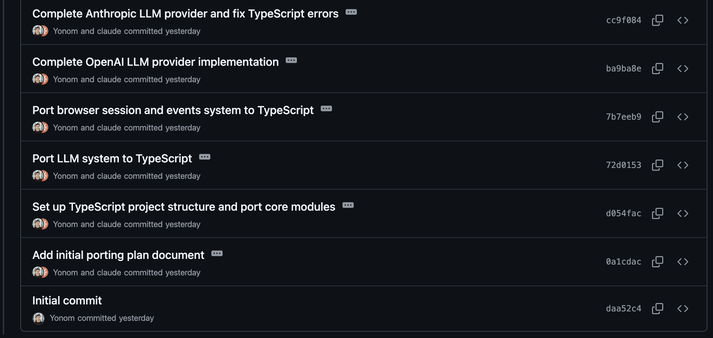
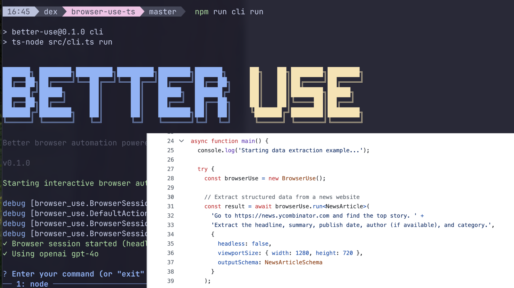

## We Put a Coding Agent in a While Loop and It Shipped 6 Repos Overnight

This weekend at the YC Agents hackathon, we asked ourselves: *what’s the weirdest way we could use a coding agent?*  

Our answer: run Claude Code headlessly in a loop forever and see what happens.

Turns out, what happens is: you wake up to 1,000+ commits, six ported codebases, and a wonky little tool we’re calling [RepoMirror](https://github.com/repomirrorhq/repomirror). 

### how we got here

We recently stumbled upon a technique promoted by [Geoff Huntley](https://ghuntley.com/ralph/), to run a coding agent in a while loop:

```
while :; do cat prompt.md | claude -p; done
```

One of our team members, Simon, is the creator of assistant-ui, a react library for building AI interfaces in React. He gets a lot of requests to add Vue.js support, and he wondered if the approach would work for porting assistant-ui to vue.js.

### how it works

basically what we ended up doing sounds really dumb, but it works suprisingly well - describes areally simple bash script, that essentially runs a coding agent in a loop forever using a static prompt. We used claude code:

```
while :; do cat prompt.md | claude -p --dangerously-skip-permissions; done
```

The prompt was simple:

```
Your job is to port assistant-ui-react monorepo (for react) to assistant-ui-vue (for vue) and maintain the repository.

You have access to the current assistant-ui-react repository as well as the assistant-ui-vue repository.

Make a commit and push your changes after every single file edit.

Use the assistant-ui-vue/.agent/ directory as a scratchpad for your work. Store long term plans and todo lists there.

The original project was mostly tested by manually running the code. When porting, you will need to write end to end and unit tests for the project. But make sure to spend most of your time on the actual porting, not on the testing. A good heuristic is to spend 80% of your time on the actual porting, and 20% on the
testing.
```

### porting browser-use to typescript

Since we were at the YC Agents hackathon, we wanted to do something related to the sponsor tooling, so we decided to see if ralph could port [Browser Use](https://github.com/browser-use/browser-use), a YC-backed web agent tool, from python to typescript.

We kicked off the loop with a simple prompt:

```
Your job is to port browser-use monorepo (Python) to better-use (Typescript) and maintain the repository.

Make a commit and push your changes after every single file edit.

Keep track of your current status in browser-use-ts/agent/TODO.md
```

After a few iterations of the loop, it seemed to be on track:



### what happened

We worked until after 2am, setting up a few VM instances (tmux sessions on gcp instances) to run the claude code loops, then headed home to get a few hours of sleep. 

We came back in the morning to an [almost fully functional port](https://github.com/repomirrorhq/better-use) of Browser Use to Typescript. 



Here it is scraping the top 3 posts from Hacker News.

[better-use.webm](https://github.com/user-attachments/assets/bdd15e9e-08e4-48a2-a6f9-05a550347c46)

[view on youtube](https://www.youtube.com/watch?v=fqp8EbYOPk8)

Here's the Browser Use founder [@gregpr07](https://x.com/gregpr07), checking out the code. we think he liked it.


### we did some more

Since we were spinnig up a few loops anyways, we decided to port a few more software projects to see what came out.

The Vercel AI SDK is in typescript... but what if you could use it in python? Yeah ... [it kind of worked](https://github.com/repomirrorhq/ai-sdk-python). 


If you've ever struggled with some of the deeply-nested type constructors in the AI SDK. Well now you can struggle with them in python too.

We also tried a few specs-to-code loops - recreating [Convex](https://www.convex.dev) and [Dedalus](https://dedalus.dev) from their docs' llms-full.txt - Here's a first pass at [OpenDedalus](https://github.com/repomirrorhq/open-dedalus)


### what we learned

**Early Stopping** 

When starting the agents, we had a lot of questions. Will the agent write tests? Will it get stuck in an infinite loop and drift into random unrelated features? 

We were pleasantly suprised to find that the agent wrote tests, kept to its original instructions, never got stuck, kept scope under control and mostly declared the port 'done'.

After finishing the port, most of the agents settled for writing extra tests or contiuosly updating agent/TODO.md to clarify how "done" they were. In one instance, the agent actually used `pkill` [to terminate itself](https://www.youtube.com/watch?v=UOLBTRazZpM) after realizing it was stuck in an infinite loop. 


**Overachieving** 

Another cool emergent behavior (as is common with LLMS) - After finishing the initial port, our AI SDK Python agent started adding extra features such as an integration for Flask and FastAPI (something that has no counterpart in the AI SDK JS version), as well as support for schema validators via Pydantic, Marshmellow, JSONSchema, etc.

**Keep the prompt Simple** 

Overall we found that less is more - a simple prompt is better than a complex one, you want to focus on the engine, not the scaffolding. Different members of our team kicking off different projects played around with instuctions and ordering, here are a few of their prompts:

At one point we tried “improving” the prompt with Claude’s help. It ballooned to 1,500 words. The agent immediately got slower and dumber. We went back to 103 words and it was back on track. 

**This is not perfect** 

For both [better-use](https://github.com/repomirrorhq/better-use) and [ai-sdk-python](https://github.com/repomirrorhq/ai-sdk-python), the headless agent didn't always deliver perfect working code. We ended up going in and updating the prompts incrementally or working with claude code interactive to get things from 90% to 100%. 

And as much as Claude may [claim that things are 100% perfectly implemented](https://github.com/repomirrorhq/better-use/blob/master/agent/TODO.md), there are a few browser-use demos from the python project that don't work yet in typescript.


### numbers

We spent a little less than $800 on inference for the project. Overall the agents made ~1100 commits across all software projects. Each sonnet agent costs about $10.50/hour to run overnight.


### what we built around it

As we went about bootstrapping so many of these, we put together a simple tool to help set up a source/target repo pair for this sync work. (and yeah, [we also built that with ralph](https://github.com/repomirrorhq/repomirror/blob/main/prompt.md))

```
npx repomirror init \
    --source-dir ./browser-use \
    --target-dir ./browser-use-zig \
    --instructions "convert browser use to zig"
```

Instructions can be anything like "conver from react to vue" or "change from grpc to rest using OpenAPI spec codegen".

Its not perfectly architected, and its a little hacky. But it was enough to hack things together, and it's designed similar to Shadcn's "open-box" approach where it generates scripts/prompts that you are welcome to modify after `init` phase. 

After the init phase, you'll have:


```
.repomirror/
   - prompt.md
   - sync.sh
   - ralph.sh
```

When you've checked out the prompt and you're ready to test it, you can run `npx repomirror sync` to do a single iteration of the loop, and you can run `npx repomirror sync-forever` to kick off the ralph infinite loop:

[repomirror.webm](https://github.com/user-attachments/assets/7616825a-064d-4a5b-b1bc-08fc5f816172)

[view on youtube](https://www.youtube.com/watch?v=_GxemIzk2lo)


If you wanna play with some of the other repos, they're listed on the [readme](https://github.com/repomirrorhq/repomirror?tab=readme-ov-file#projects). [better-use](https://github.com/repomirrorhq/better-use) is now on npm:

```
npx better-use run
```

ai-sdk-python still has [one or two issues](https://github.com/repomirrorhq/ai-sdk-python/blob/master/agent/FIX_PLAN.md) that we're working on before it makes it to PyPI.

### closing thoughts

As you might imagine, our thoughts are all a little chaotic and conflicting, so rather than a cohesive conclusion, we'll just leave with a few of our team's personal reflections on the last ~29 hours:


> I'm a little bit feeling the AGI and its mostly exciting but also terrifying.

> The minimalist in me is happy to have hard proof that we are probably overcomplicating things. 

> clear to me that we're at the very very beginning of the exponential takeoff curve

Thanks to the whole team [@yonom](https://x.com/simonfarshid) and [@AVGVSTVS96](https://x.com/AVGVSTVS96) from [assistant-ui](https://github.com/assistant-ui), [@dexhorthy](https://x.com/dexhorthy) from [HumanLayer](https://humanlayer.dev),  [@Lantos1618](https://x.com/Lantos1618) from [github.gg](https://github.gg), and to [Geoff](https://x.com/GeoffreyHuntley) for the inspiration.


